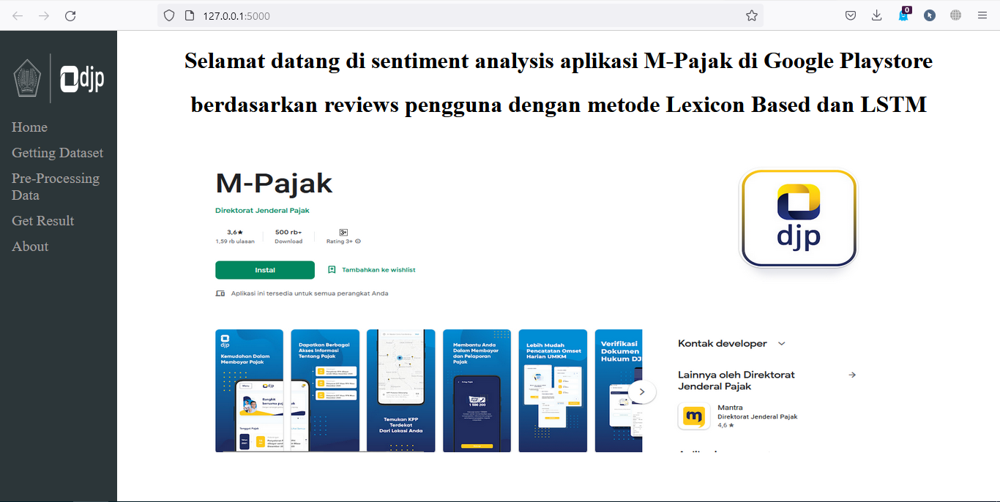
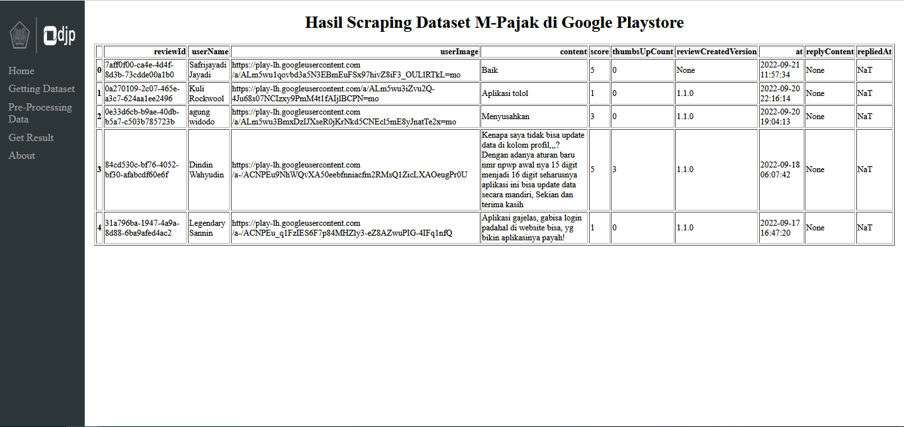
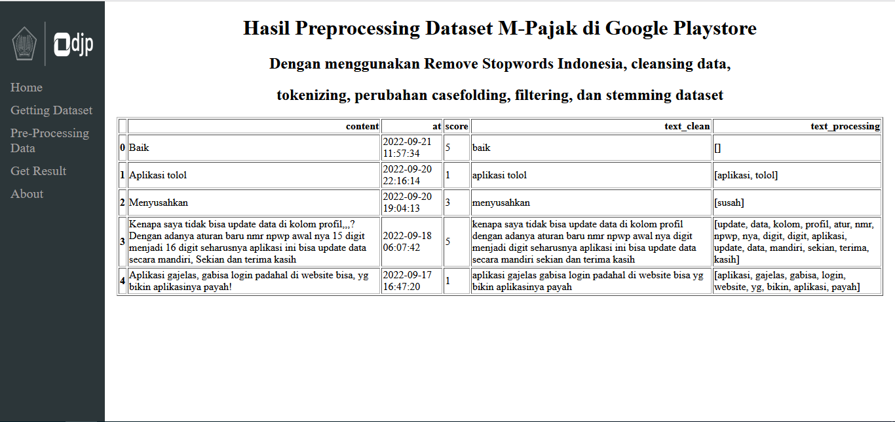
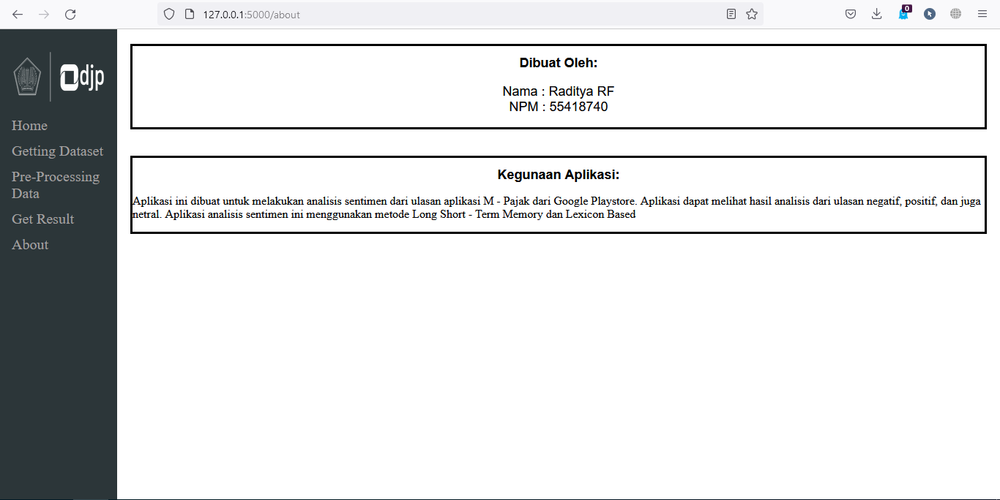

# About
The purpose of creating this application is to help the government, especially the Directorate General of Taxes (DJP) in improving and fixing the problems that exist in the M - Tax application. This application is built using Flask as its framework and uses the Long Short - Term Memory (LSTM) and Lexicon Based algorithms in conducting sentiment analysis. Long Short - Term Memory Algorithm successfully performs analysis with an accuracy rate of 81%

# Screenshot

## Home

## Scraping Dataset

## Pre - Processing 

## Result

## About


# How To Install
1. Make sure python 3.10 is installed or you can download it from [here](https://www.python.org/downloads/)
2. Install library needed in requirement.txt
    ```
    pip -m install requirements.txt
    ```
3. Run code below and wait for training LSTM model
    ```
    flask run
    ```
4. Enjoy the application :smiley:


